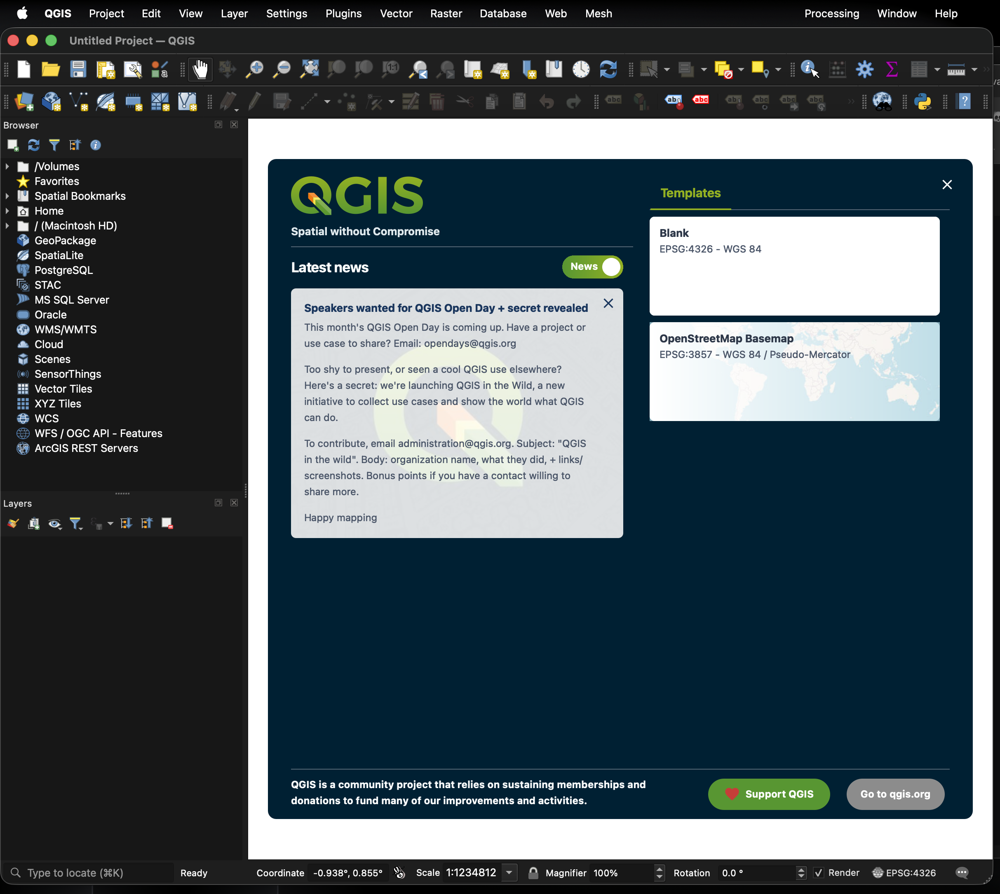

# Estadística Espacial con QGIS

  <b>Práctica Calificada 1</b> 
  Instalación de QGIS · Capa ráster · Capa vectorial

## Objetivo

Documentar la instalación y el uso inicial de **QGIS Desktop** para el análisis espacial, identificando las diferencias entre información ráster y vectorial.

## Entorno de trabajo

| Componente | Implementación |
|---|---|
| Sistema de Información Geográfica | QGIS Desktop |
| Capa ráster | OpenStreetMap Raster mediante teselas XYZ |
| Capa vectorial | Capa temporal de geometría de puntos |
| Sistemas de referencia | EPSG:4326 y EPSG:3857 |

---

## Evidencias de la práctica

### 1. Instalación de QGIS

QGIS fue instalado correctamente y se verificó su ejecución mediante la creación de un proyecto nuevo.

### 2. Capa ráster — OpenStreetMap Raster

Se incorporó una capa ráster a través de una conexión XYZ a OpenStreetMap. La información ráster se representa en celdas o píxeles y permite visualizar una base cartográfica continua.

### 3. Capa vectorial — Puntos

Se creó la capa **Capa_Vectorial_Punto** y se registraron entidades puntuales. Las capas vectoriales representan objetos geográficos mediante geometrías, tales como puntos, líneas o polígonos.

---

## Procedimiento reproducible

1. Abrir **QGIS Desktop** y crear un proyecto nuevo.
2. Agregar la capa ráster con **Capa → Añadir capa → Añadir capa XYZ**.
3. Crear la capa vectorial con **Capa → Crear capa → Nueva capa temporal**.
4. Seleccionar geometría de punto y añadir una entidad sobre el mapa.
5. Guardar las evidencias del procedimiento.

## Archivos del repositorio

| Archivo | Descripción |
|---|---|
| `instalacion_qgis.png` | QGIS instalado y funcionando |
| `capa_raster.png` | Evidencia de la capa ráster OpenStreetMap |
| `capa_vectorial.png` | Evidencia de la capa vectorial de puntos |

---

**Autor:** Richar Andre Vilca Solorzano  
**Curso:** Estadística Espacial  
**Universidad Nacional del Altiplano — Puno**
